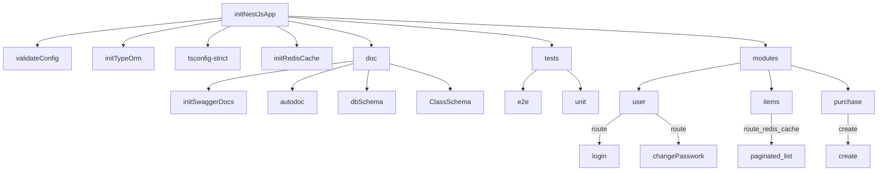

```mermaid
flowchart TD
  initNestJsApp --> validateConfig
  initNestJsApp --> initTypeOrm
  initNestJsApp --> tsconfig-strict
  initNestJsApp --> initRedisCache
  initNestJsApp --> doc
   doc --> initSwaggerDocs
   doc --> autodoc
   doc --> dbSchema
   doc --> ClassSchema
  initNestJsApp --> tests
  tests --> e2e
  tests --> unit
  initNestJsApp --> modules
  modules --> user
  user --> |route|login
  user --> |route|changePasswork
  modules --> items
  items --> |route_redis_cache| paginated_list
  modules --> purchase
  purchase --> |create|create
```
